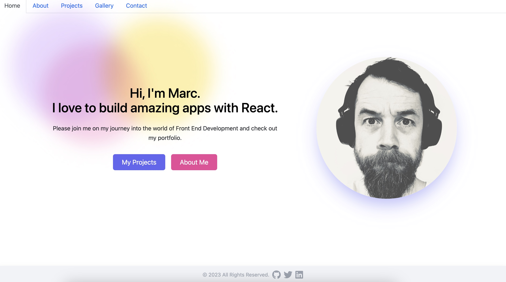
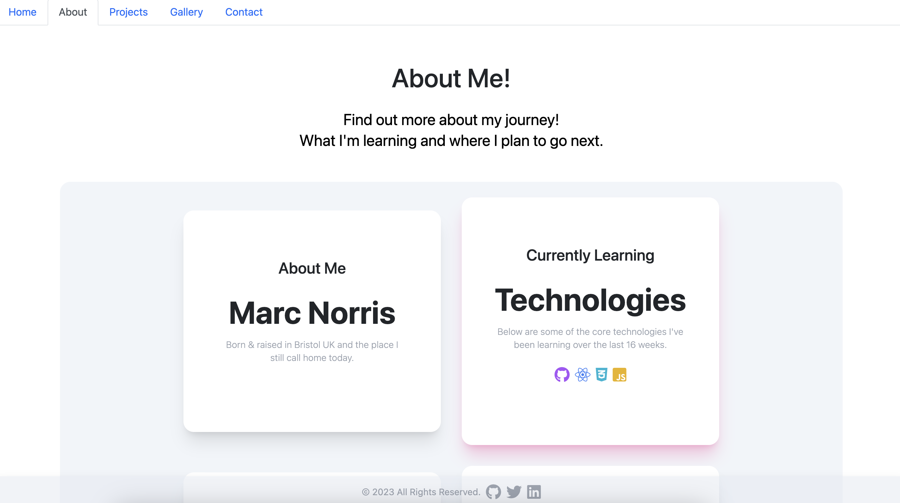
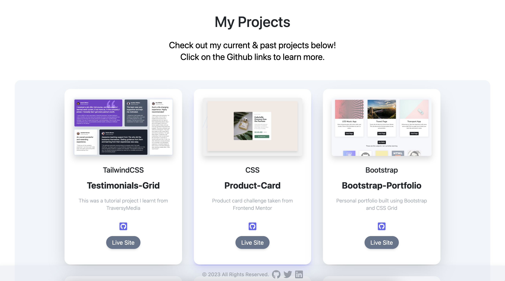
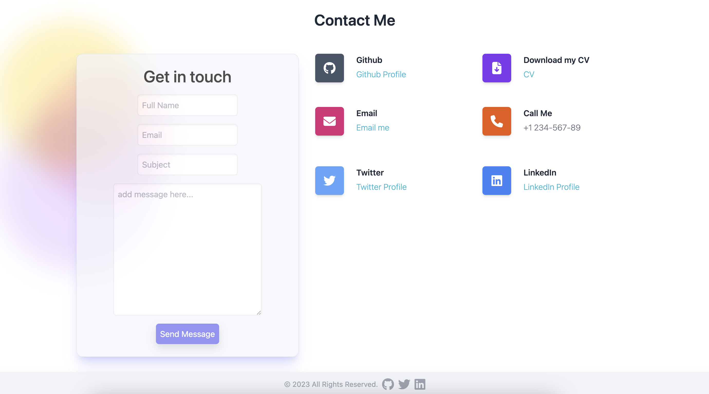

# React Portfolio

## My React Site:

Welcome to my portfolio. This portfolio was built using react. I used a mobile first approach building this site to ensure that it's fully responsive on all device types.

I have utilised React-Router-DOM which enables me to implement dynamic routing.

All of the styling on this site has been implemented using Tailwind CSS. Tailwind CSS is a utility first CSS framework. This enables me to build the skeleton of my site with HTML and style inline.

 

**Table of Contents:**

* [Installation](#installation)
* [Usage](#usage)
* [Screenshots](#screenshots)
* [Credits](#credits)
* [License](#license)

 

**Instructions**

## Installation

 

* Please visit my portfolio site: https://shaky411.github.io/react-portfolio-new/

 

# Usage

N/A

 

## Screenshots

 

## Credits

* Traversy Media: Many of my core Tailwind skills are thanks to the amazing learning content created by Traversy Media.

* Front End Mentor: Some of my projects displyed within my portfolio were initially created by Front End Mentor.

 

## License

* _This application has the MIT Licence_
For more info, please go to the [licence description](https://opensource.org/license/mit/)
